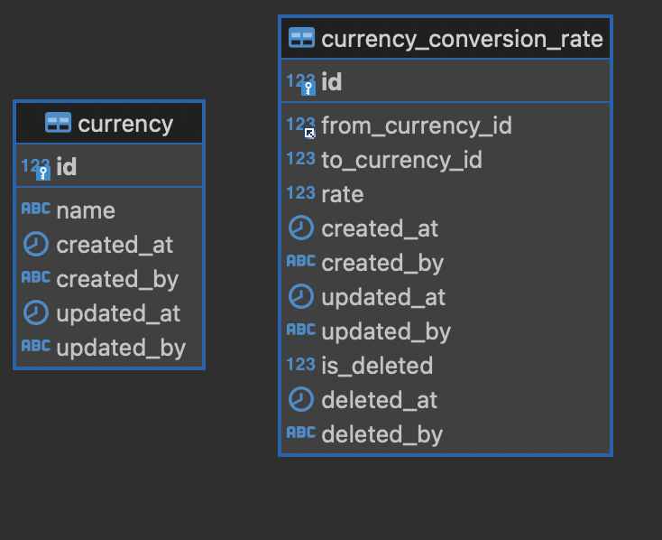

# CURRENCY APIs

# Running The Apps
```shell
# Run in the background:
docker-compose up -d

# Notes: The application may not start immediately,
# the application will start as soon as the all depedencies is ready (e.g database).
# Currently, we use https://github.com/ufoscout/docker-compose-wait for waiting tools. 

# We recommend to not run containers in the background.
# it will be easier for you to see the application state (ready/not).
# Use this following command:

docker-compose up --build
```
# Stopping The Apps
```shell
docker-compose down --remove-orphans --volumes
```

# Database Schema


# APIs Contract
APIs contract for currency-api service

## Create new currency
### Request
`POST /api/v1/currency/create/`

```shell
curl --location --request POST 'http://localhost:8081/api/v1/currency/create' \
--header 'Content-Type: application/json' \
--data-raw '{
    "id":1,
    "name":"test"
}'
```

#### Payload
- id (int, required)
- name (string, required)

### Response
```shell
# Success
{
    "status": "success",
    "code": 200,
    "data": "",
    "message": "success"
}

# Bad request
{
    "status": "error",
    "code": 400,
    "message": " Name is required"
}
```

## Create new conversion rate
### Request
`POST /api/v1/currency/conversion/create`

```shell
curl --location --request POST 'http://localhost:8081/api/v1/currency/conversion/create' \
--header 'Content-Type: application/json' \
--data-raw '{
    "from":2,
    "to":3,
    "rate":29
}'
```

#### Payload
- from (int, required)
- to (int, required)
- rate(float, required, should be greater than or equal 0, default 0)

### Response
```shell
# Success
{
    "status": "success",
    "code": 200,
    "data": "",
    "message": "success"
}

# Bad request
{
    "status": "error",
    "code": 400,
    "message": " To is required"
}
```

## Convert currency
### Request
`POST /api/v1/currency/conversion/convert`

```shell
curl --location --request POST 'http://localhost:8081/api/v1/currency/conversion/convert' \
--header 'Content-Type: application/json' \
--data-raw '{
    "from":3,
    "to":2,
    "amount":29
}'
```

#### Payload
- from (int, required)
- to (int, required)
- amount(float, required, should be greater than or equal 0, default 0)

### Response
```shell
# Success
{
    "status": "success",
    "code": 200,
    "data": 1,
    "message": "success"
}

# Bad request
{
    "status": "error",
    "code": 404,
    "message": "conversion rate from 3 to 20 not found"
}
```

## Get list currencies
### Request
`GET /api/v1/currency/list`

```shell
curl --location --request GET 'http://localhost:8081/api/v1/currency/list?startingAfter=0&startingBefore=0&limit=0&all=false' \
--data-raw ''
```

#### Params
- startingAfter (int, optional, used to fetch next page by given the last ID in current page)
- startingBefore (int, optional, used to fetch previous page by given the first ID in current page)
- limit (int, required if all=false, should be greater than 0)
- all (boolean, optional, set to true if you want to load all data)

### Response
```shell
# Success
{
    "status": "success",
    "code": 200,
    "data": {
        "currencies": [
            {
                "id": 3,
                "name": "sdas"
            },
            {
                "id": 4,
                "name": "sdas"
            }
        ],
        "pagination": {
            "totalItems": 6,
            "totalPage": 3
        }
    },
    "message": "success"
}

# Empty data
{
    "status": "success",
    "code": 200,
    "data": {
        "currencies": null,
        "pagination": {
            "totalItems": 6,
            "totalPage": 3
        }
    },
    "message": "success"
}
```